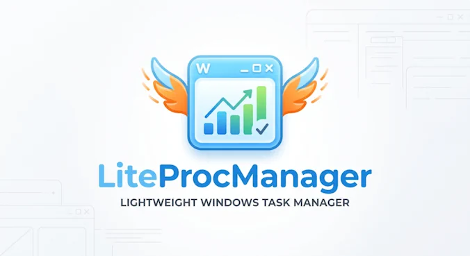
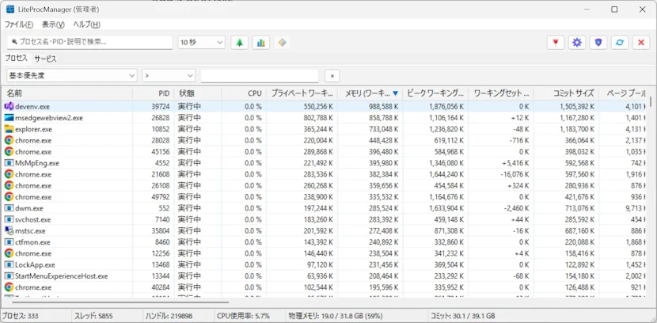
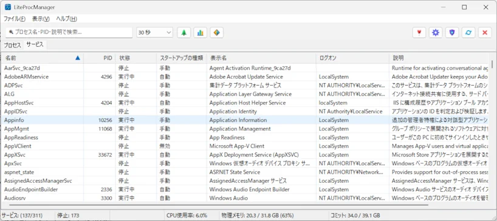

# LiteProcManager

-blue.svg) 




## 概要

LiteProcManagerはWindowsのタスクマネージャーよりそこそこ超軽量なプロセスマネージャー＆Windowsサービス管理ツールです。
最小限のCPU負荷と省メモリで軽快に動作します。
またこのアプリケーションは9割ほどAIで実装しています。


## 主な機能

### 1. プロセス管理
* プロセス一覧表示
  * Windowsタスクマネージャと同じ項目を表示
  * 親プロセスと子プロセスの親子関係を階層構造（ツリービュー）で視覚的に把握可能
* プロセス操作
  * プロセスの強制終了
  * プロセスの実行優先度の動的変更
* フィルター＆検索
  * クイック検索バーによるインクリメンタル絞り込み
  * カラム条件指定による高度な条件フィルター
* 柔軟なカラムカスタマイズ
  * 表示したい項目の選択ダイアログ、列幅や並び替えの自動保存。
* クリップボード連携
  * 選択プロセスの情報をセル単位、JSON形式、TSV形式でコピー




### 2. Windows サービス管理
* サービス一覧
  * システムに登録されている全Windowsサービス情報を一覧表示
* サービスの操作
  * サービスの開始、停止、再起動
  * スタートアップの種類変更




### 3. プロセス監視＆アラート通知

* リアルタイムプロセス監視
  * 指定したプロセス名に対する終了イベントの検知
  * 指定したプロセス名に対するリソース判定
* トースト通知
  * 監視対象プロセスのイベント発生時にデスクトップ右下にモダンなトースト通知を表示


### 4. UI・ユーザビリティ
* 更新インターバル設定
  * 更新頻度を自由に変更可能
  
* 常に最前面に表示 (Always on Top)
  * ワンクリックでウィンドウの最前面表示を切り替え
  
* タスクトレイ常駐
  * 最小化時やクローズ時にタスクトレイへ格納しバックグラウンドでの常駐動作に対応
  
* 管理者権限での再起動
  * 特権が必要なプロセス操作のためにUAC昇格によるワンクリック再起動ボタンを配置
  
  

## ビルド方法

### 1. 前提要件
* OS: Windows 10 / 11 (x64)
* 開発環境: Visual Studio 2026（ v145 ツールセット対応）
* インストーラー: Inno Setup 7

### 2.  ビルド

```cmd
> build.bat
```


## ライセンス

本ソフトウェアのソースコードは Apache License 2.0 のもとで公開されています。詳細については LICENSE ファイルまたは各ソースファイルをご確認ください。
